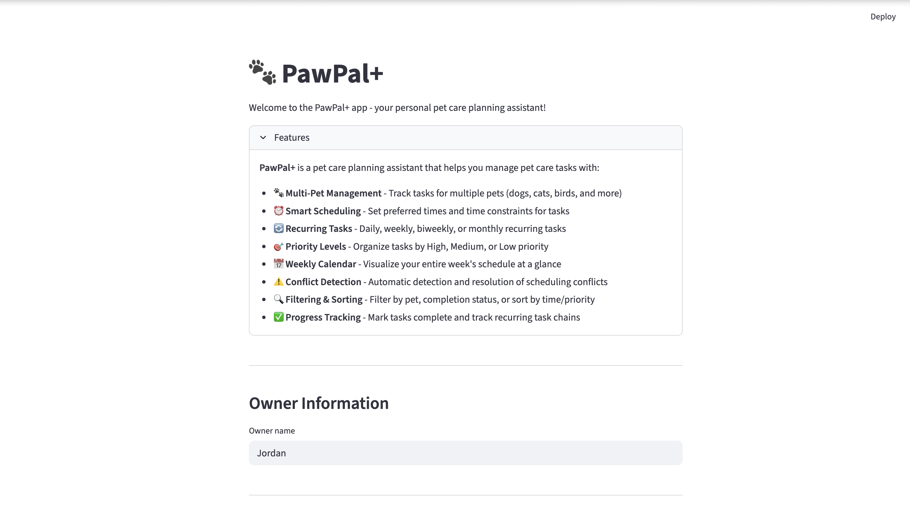
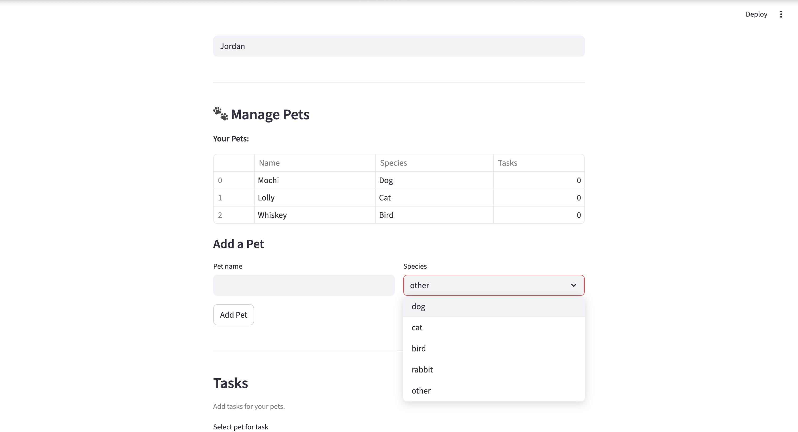
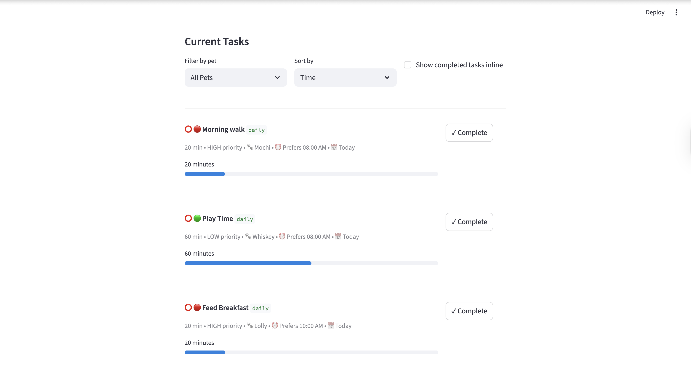
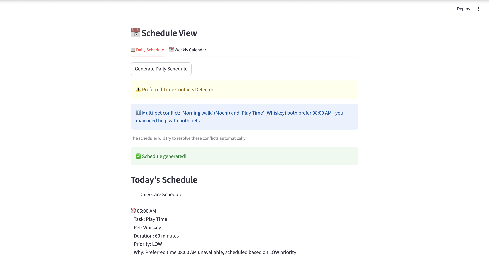

# PawPal+ (Module 2 Project)

You are building **PawPal+**, a Streamlit app that helps a pet owner plan care tasks for their pet.

## Scenario

A busy pet owner needs help staying consistent with pet care. They want an assistant that can:

- Track pet care tasks (walks, feeding, meds, enrichment, grooming, etc.)
- Consider constraints (time available, priority, owner preferences)
- Produce a daily plan and explain why it chose that plan

Your job is to design the system first (UML), then implement the logic in Python, then connect it to the Streamlit UI.

## What you will build

Your final app should:

- Let a user enter basic owner + pet info
- Let a user add/edit tasks (duration + priority at minimum)
- Generate a daily schedule/plan based on constraints and priorities
- Display the plan clearly (and ideally explain the reasoning)
- Include tests for the most important scheduling behaviors

## Getting started

### Setup

```bash
python -m venv .venv
source .venv/bin/activate  # Windows: .venv\Scripts\activate
pip install -r requirements.txt
```

### Suggested workflow

1. Read the scenario carefully and identify requirements and edge cases.
2. Draft a UML diagram (classes, attributes, methods, relationships).
3. Convert UML into Python class stubs (no logic yet).
4. Implement scheduling logic in small increments.
5. Add tests to verify key behaviors.
6. Connect your logic to the Streamlit UI in `app.py`.
7. Refine UML so it matches what you actually built.

### Smarter Scheduling

New features include:
- Sorting: Tasks that are added out of order are automaically sorted and displayed chronologically.

- Filtering: Tasks can be filtered by completion status and pet.

- Automated Recurring Tasks: Users are able to set tasks as recurring with frequency options for daily, weekly, biweekly, or monthly. When recurring tasks are marked as complete, the next occurence is auto-generated.

- Conflict Detection: The system checks for overlapping preferred times before scheduling and returns warning messages if found, instead of crashing. Conflicts are categorized by same pet (critical) or multi-pet (informative), and include specific details of pet names.

### Features List

#### 🐾 Multi-Pet Management
- **Track unlimited pets** across different species (dogs, cats, birds, rabbits, and more)
- **Pet profiles** with customizable preferences and restrictions
- **Per-pet task organization** with visual indicators showing task counts
- **O(1) pet lookup** using dictionary-based storage for performance

#### ⏰ Smart Scheduling System
- **15-minute time slot bitmap** algorithm for efficient scheduling (6 AM - 10 PM window)
- **Preferred time scheduling** - Tasks scheduled at user's preferred times when available
- **Time constraints** - Support for "before" and "after" constraints (e.g., "before 09:00")
- **Automatic conflict resolution** - Scheduler finds alternative slots when preferred times conflict
- **Priority-based allocation** - High-priority tasks get first choice of time slots
- **Smart break insertion** - Automatic 15-minute breaks after tasks exceeding 30 minutes

#### 🔄 Recurring Tasks
- **Multiple frequency options**: Daily, Weekly, Biweekly, Monthly
- **Automatic next occurrence generation** - When completed, next task auto-created
- **Parent task linking** - All occurrences linked via `parent_task_id` for tracking
- **Edge case handling** - Smart handling of month-end dates (e.g., Jan 31 → Feb 28)
- **Year boundary support** - Correctly handles tasks crossing calendar years

#### 🎯 Priority & Organization
- **Three priority levels**: High (🔴), Medium (🟡), Low (🟢)
- **Visual priority indicators** - Color-coded emojis throughout the interface
- **Priority-based scheduling** - Higher priority tasks scheduled first
- **Duration-aware sorting** - Within same priority, longer tasks scheduled first

#### 📅 Weekly Calendar View
- **7-day grid visualization** - Monday-Sunday weekly view
- **Compact task cards** - Time, title, duration, and pet displayed efficiently
- **Date range selector** - Choose any week to view schedules
- **Summary statistics** - Total tasks, scheduled, and unscheduled counts
- **Multi-day scheduling** - Generates optimized schedules for each day independently

#### ⚠️ Conflict Detection & Validation
- **Preferred time conflict detection** - Warns before scheduling if overlaps exist
- **Two conflict types**:
  - **Same-pet conflicts** (🔴 Critical) - One pet can't do two tasks simultaneously
  - **Multi-pet conflicts** (ℹ️ Informational) - Owner may need help with concurrent tasks
- **Final schedule validation** - Verifies no conflicts in completed schedule
- **Constraint violation checking** - Ensures all time constraints are respected

#### 🔍 Filtering & Sorting
- **Filter by pet** - View tasks for specific pets or all pets
- **Filter by completion** - Toggle between incomplete, completed, or all tasks
- **Sort by time** - Chronological ordering by preferred time
- **Sort by priority** - High to low priority ordering
- **Sort by pet name** - Alphabetical organization
- **Combined filtering** - Stack multiple filters for precise task views

#### ✅ Progress Tracking
- **Completion status** - Mark tasks complete with one click
- **Recurring task chains** - Track relationships between task occurrences
- **Completion indicators** - ✅ for completed, ⭕ for pending
- **Completed tasks section** - Collapsible view of finished tasks
- **Next occurrence preview** - See when recurring tasks will appear next

#### 📊 Visual Schedule Display
- **Daily schedule explanation** - Text-based breakdown with reasoning
- **Task cards** - Rich display with time, duration, priority, and pet info
- **Duration progress bars** - Visual representation of task length (scaled to 2 hours)
- **Date context** - "Today", "X days overdue", or future date indicators
- **Recurring badges** - Visual tags showing task frequency

#### 🧠 Session State Management
- **Persistent data** - Owner and all tasks preserved across page refreshes
- **Streamlit session_state** - Data stored in memory vault between reruns
- **Task index optimization** - O(1) task lookup by ID across all pets
- **Automatic synchronization** - Changes to owner name instantly reflected

#### 🛠️ Technical Features
- **UUID-based task IDs** - Guaranteed unique identification for every task
- **Backward compatibility** - Non-recurring tasks work without frequency/date
- **Idempotent operations** - Completing tasks multiple times handled gracefully
- **Fallback search** - Task index includes fallback linear search for robustness
- **Type safety** - Enum-based Priority and Frequency for type checking

### 📸 Demo










